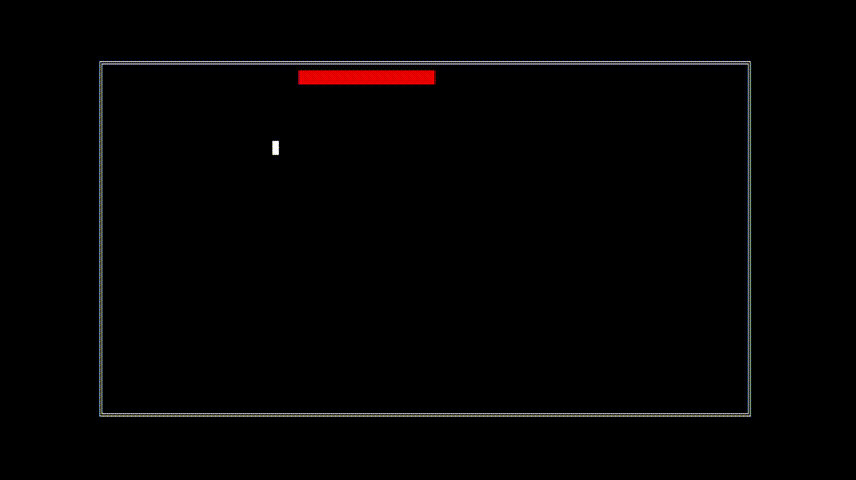

# Proyecto-Final-IP

> [!NOTE]
> En la carpeta **/src** se encuentra el código del proyecto.
> En la carpeta **/build** se encuentran los archivos ejecutables.

Proyecto Final en C de la asignatura IP sobre un sistema para la administración de los 
Juegos Deportivos de la FEU.

## 💻 Características implementadas
- Proyecto particionado en lógica e interfaz 
- Correcto uso de los `.h` y `.c`
- Archivo de definiciones generales en `/Logica/definiciones.h`
- Piscina de Datos, con sistema de datos generados automática y aleatoriamente. 
- Sistema de introducción manual de datos, pudiendo editar los datos ingresados. 
- En el sistema de introducción manual de datos, se puede aleatorizar en cualquier momento el resto de los datos por rellenar. 
- Interfaz de usuario intuitiva 
- Implementación de reportes
- Sistema de validaciones
- Animaciones personalizadas
- Easter Egg de Orqui

## 📸 Documentación general de la interfaz
### Inicio
> [!TIP]
> Puede saltar la animación del logo presionando cualquier tecla
> 
> 

## 👾 Importación del proyecto
> [!IMPORTANT]
> Para importar el proyecto, debe tener de pre-requisito el Qt Creator ~= 5.3

Los pasos son:
1. Clonar el repositorio o descargarlo.
2. Importar con el Qt Creator el proyecto a través del archivo `/src/tareaFinal.pro`.

## 🚀 Descarga del ejecutable
Para descargar el ejecutable siga [el siguiente enlace](https://github.com/EduardoProfe666/Proyecto-Final-IP/releases/latest). 

Para ejecutarlo una vez descargado:
1. Ejecutar el `.exe` en la misma ruta que los otros 2 archivos necesarios.

